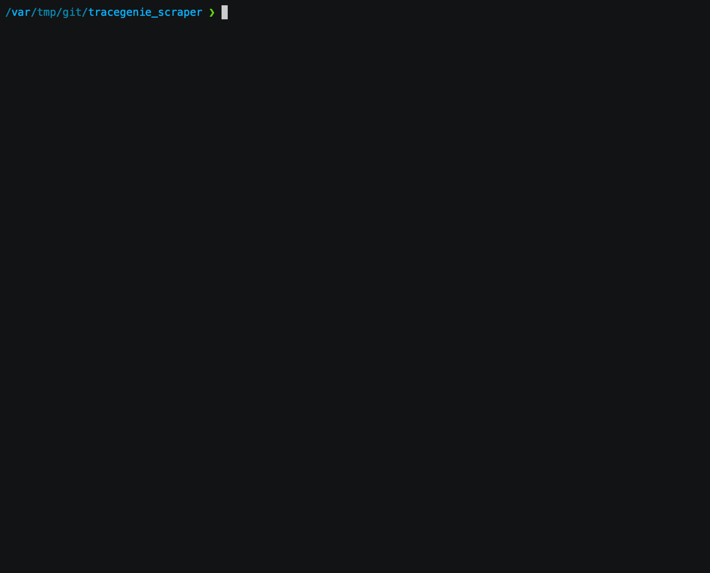

# tracegenie_scraper
tracegenie.com to CSV web scraper
You will need a username and password with a subscription for the scraper to function.

Once the python modules have been installed:
```bash
pip install -r requirements.txt
```
Run this command with the below arguments:
```python
{python 3.x} tracegenie_scrape.py -n {last name} -p {postcode}
```
Optionally, you can use an input file with the -f flag with a list of last names. Also you can optionally specify an output file that will save the results to a csv.
```python
{python 3.x} tracegenie_scrape.py -f {filepath} -p {postcode} -o {output file}
```

